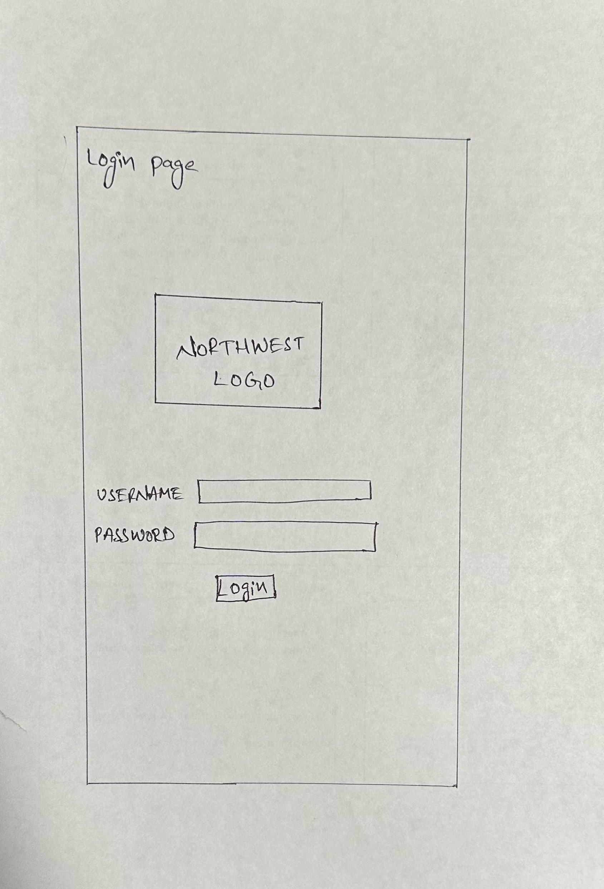
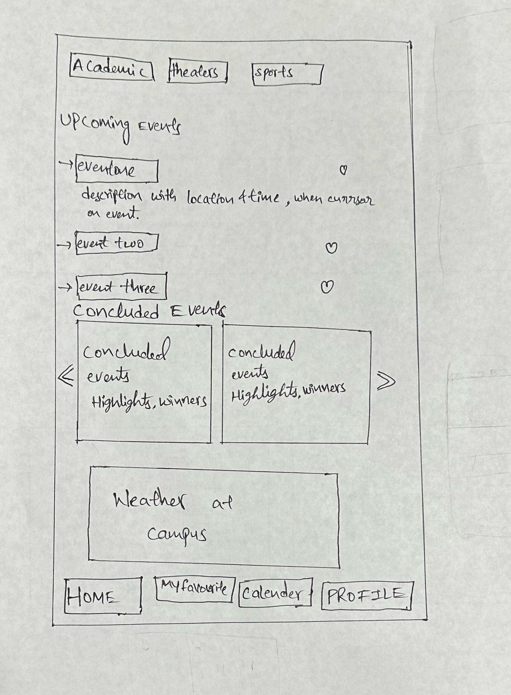
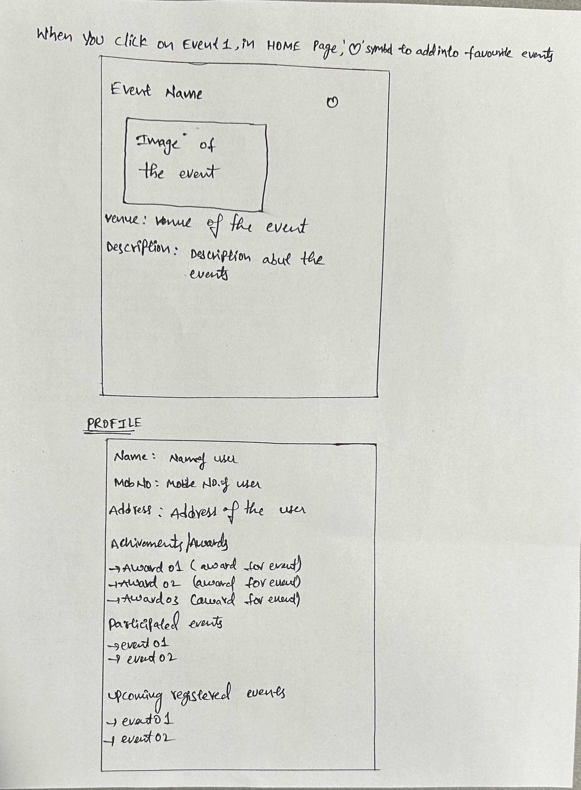
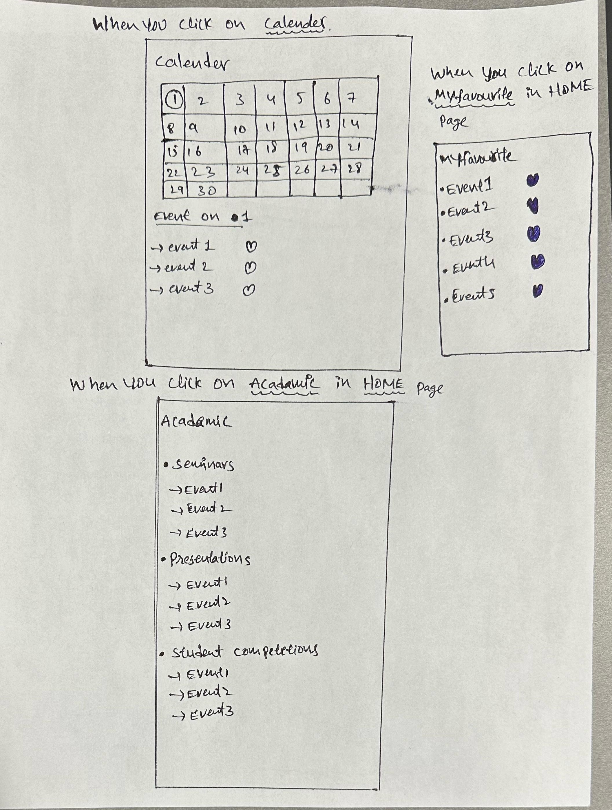
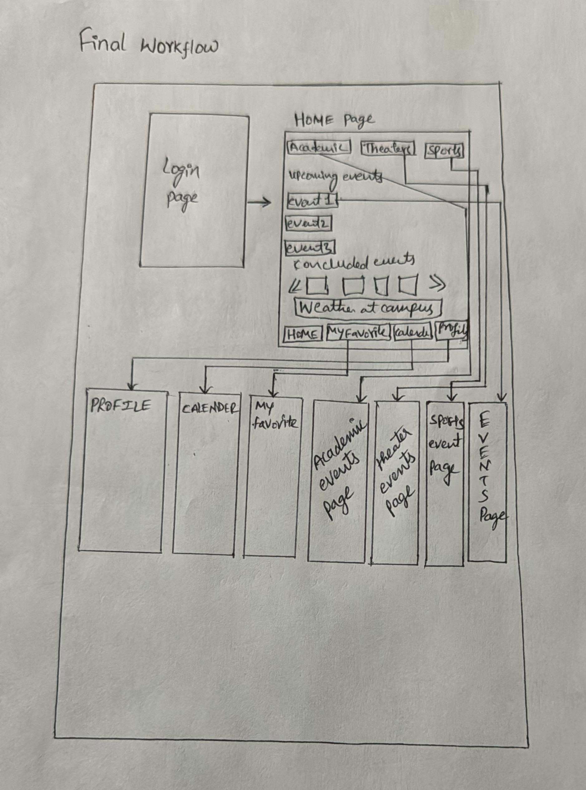

# 44643Sec02Team02Spring2024FinalProject

<h1>CampusChronicle: Your Ultimate University Event & Weather Guide</h1>

University Event & Campus Weather App, Your one-stop destination for staying informed about the latest happenings on campus, from thrilling sports events and lively music performances to blockbuster movie shows, vibrant university fests, and even the current weather conditions. Students are the targeted users of this app.
<h2>Key features are :</h2>
<h4>Sports Events Updates :</h4> Dive into the world of sports with real-time updates on games, matches, and tournaments happening right here on campus. Follow your favorite teams, check schedules, and never miss a moment of the action.
<h4>Music Events :</h4> Our app keeps you in the loop on all things musical. Discover upcoming events, plan your evenings, and share the experience with fellow music enthusiasts.
<h4>Movie shows :</h4>  Find out about the latest movie showtimes, special screenings, and film festivals taking place at the university. Whether it's a classic film or a new release, our app ensures you're always aware of the cinematic delights on campus.
<h4>Fest Extravaganza:</h4> Experience the vibrant energy of university fests and cultural events. Stay updated on festivities, performances, and celebrations that define the spirit of your campus. Be a part of the excitement and make lasting memories with friends.
<h4>Real Time Weather Repots:</h4> Get current weather conditions, forecasts, and important alerts to plan your activities accordingly. Rain or shine, our app ensures you're ready for any weather.

<h2>Roles and Responsibilities:</h2>
Krishna Babu Gali IOS (developer): Responsible for developing and maintaining the Frontend and Backend. 
Prem Rakesh Alasakani (Frontend): Responsible for maintaining the user interface (UI) and user experience (UX). 
Manideep Gattineni (Backend): Responsible for working databases and API’s.

<h3>List of Team members </h3>
1.Krishna babu Gali  
2. Prem, Alasakani 
3. Manideep, Gattineni 

This screen represents the login page , user has to enter his/her credentials. 
Navigation : when user on click of login button ,user will  be navigated to home screen  

This screen represents the home page ,  
Four buttons at bottom, namingly HOME, MYFAVOURITE, CALENDER, PROFILE  
HOME: when user clicks on this it goes home page. 
MYFAVORITE: when user clicks on the MYFAVORITE, it goes to MYFAVORITE page, where the user selected his favorite events. 
CALENDER: when user clicks on CALENDER, it goes to CALENDER page, where the user can see the events by date. 
PROFILE: when user clicks on PROFILE, it goes to the PROFILE page, where user can see his/her personal details and details about achievements, participated events and upcoming registered events. 
Three buttons at the top, namingly ACADEMIC, THEATERS, SPORTS 
 ACADEMIC: when user clicks on ACADEMIC, it goes to the ACADEMIC page where user can see events about ACADEMIC’s. 
THEATERS: when user clicks on THEATERS, it goes to the THEATERS page, where user can see events about music and movies shows. 
SPORTS: when user clicks on SPORTS, it goes to the SPORTS Page, where user can see events about SPORTS. 
Down of these buttons on the screen we can see the upcoming events, when the user clicks on event (1,2,3…) it goes to another page where user can see the event description, venue. down the screen There is an image about the concluded events and next down to the weather updates are posted here. 

Top figure in the page show, Navigation: when user clicks on the event of upcoming events section it shows this page Where user can see information about event and venue. there is heart symbol at the side of each event, where user can select the event to be in favorite by ticking on that. 
Down figure in the page shows the PROFILE, navigation: when user clicks on the PROFILE button. It shows the profile page. 

Top figure in the page show CALENDER, Navigation: when user clicks on the CALENDER, it shows the calender page, where user can be able to see the events date wise.
On the side of the CALENDER in the above image there a MyFAVORITE screen, when the user clicks on 
MYFAVORITE, it shows all the events liked by the user. 
Down figure in the page shows ACADEMIC sectioned events, Navigation: when the user clicks on the Academic button, it goes to the ACADEMIC page, where user can be able to see the events on academic’s (seminars, presentations, and student competitions) 
Same as the ACADEMIC, when the user clicks on the other two of THEATERS and SPORTS, it goes to the 
THEATERS and SPORTS pages where user can see the events related to that. 

<h3>Final Workflow</h3>

The above image is the final workflow of the project, Navigations: when the user enter her/his credentials and clicks on login and enters into the home page, in the home page there are many buttons, 
ACADEMIC, THEATERS, SPORTS, HOME, MYFAVORITES, CALENDER ,PROFILE when the user clicks on the each button, user will be navigated to respective pages . 

We have worked on designing the UI and got to make some pages on and added some animations to it. We have also worked on writing some APIs in java using springboot it deals with adding the events to the application making some changes to the already existing events delete an event and also send the users a notification when a new event is added.
The UI designed has a login page, a home page and the favourites page which interact with themselves.

In sprint 04 we have added the signup page and added some functionality for login buttons when no details are entered and written code for signup page which will be useful when one will be registering .

